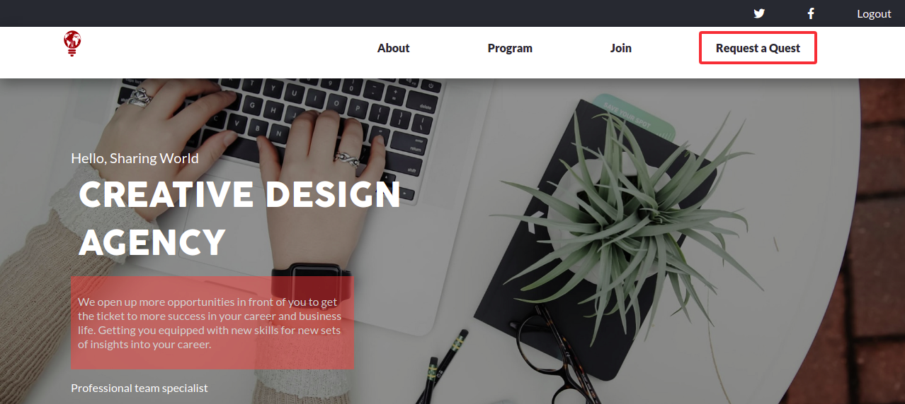
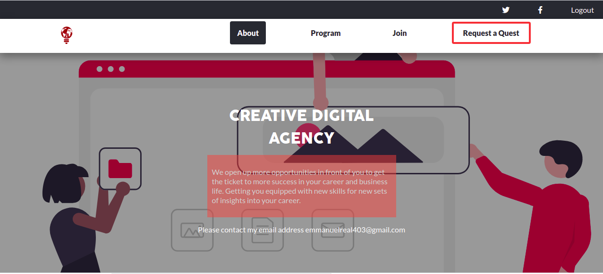

# Project Name
Digital Agency Website

# About project
This site was built as the Capstone project for Module 1 of the Microverse curriculum.

## Built With

- HTML
- CSS
- JAVASCRIPT

## Live Demo

[View Demo](https://gbengacode.github.io/Digital-agency-website/)

## Getting Started

To get a local copy up and running follow these simple example steps.

### Prerequisites

- Have git install on your local machine

### Setup

You can use this site both with and without installing the necessary files on your local PC. 

If you want to see how it works without any installations, visit live demo link

As for the installation, follow these steps

- Open the repository
- Download ZIP-archive to your PC
- Unpack the archive
- Open the index.html file
- Use the site

## Author
👤 **Author**

[Github](https://github.com/gbengacode)
[Linkedin](https://www.linkedin.com/in/emmanuel-gbenga/)

👤 **Author**

 Creative Commons license of the design

 
## 🤝 Contributing

Contributions, issues, and feature requests are welcome!

## Acknowledgments
The design was created by [Cindy Shin in Behance](https://www.behance.net/adagio07).

## licence
This project is [MIT](./MIT.md) and [Creative Commons license of the design](https://creativecommons.org/licenses/by-nc/4.0/) licensed.